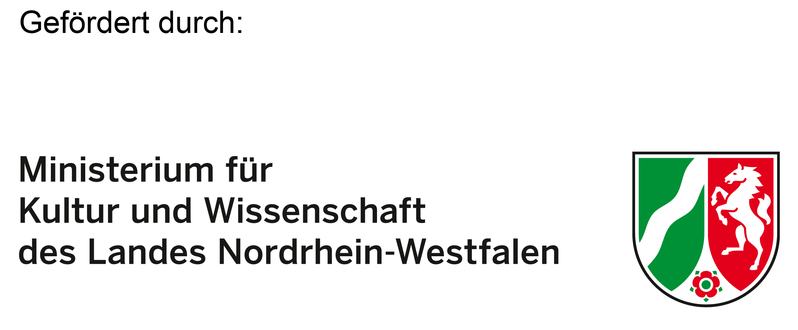

# Model-theoretic Foundations of Controversies in Economic Policy (MGWK)

*Together with Eckhard Hein, Achim Truger and Franz Prante*

Goal of the project MGWK (short for the German *Modelltheoretische Grundlagen wirtschaftspolitischer Kontroversen*) was to develop a didactic tool to teach macroeconomic interactively and from a pluralist perspective. Text and simulations are available in English and German.

:book: You can access the English version of the book here:

- [Introduction to Macroeconomics: Pluralist and Interactive](https://eng.mgwk.de/)

:book: And here the German version:

- [Einführung in die Makroökonomik: plural und interaktiv](https://www.mgwk.de/)

In the book we offer a series of interactive illustrations where the users take control of various economic policy instruments, reacting to economic problems using the appropriate policy measures.

:computer: Scenarios based on the 3-equation model of the new consensus:

- [New consensus model: The case of an aggregate demand shock](https://mgwk.shinyapps.io/scenario1_eng/)
- [New consensus model: The case of an aggregate supply shock](https://mgwk.shinyapps.io/scenario2_eng/)
- [New consensus model: The case of an aggregate demand shock and the preference of the central bank](https://mgwk.shinyapps.io/scenario1a_eng/)

:computer: Alternative scenarios based on the modification of the 3-equation model:

- [New consensus model with simplified labour market hysteresis: The case of an aggregate demand shock](https://mgwk.shinyapps.io/scenario1c_eng/)
- [A post-Keynesian variation of the 3-equation new consensus model: The case of a positive aggregate demand shock with interest rate elastic mark-up](https://mgwk.shinyapps.io/scenario1b_eng/)
- [Post-Keynesian Phillips curve with horizontal element: Demand shocks, fiscal policy and wage coordination](https://mgwk.shinyapps.io/scenario3pk_eng/)

:arrow_right: We have also created interactive applications that allow to play around with the 3-equation model of the new consensus:

- [Aggregate demand/supply shock and exogenous policy reaction](https://mgwk.shinyapps.io/full_model2_eng/)
- [Aggregate demand/supply shock and endogenous policy reaction](https://mgwk.shinyapps.io/full_model1_eng/)

The remaining apps and scenarios are accessible in the online book in the relative chapters. Have fun with the book:exclamation:

Visit also the [project website](https://projekt.mgwk.de/index.html)! *(in German)*

**Funded by:**

  

**Project partners:**

    
    
    

<head>

</head>

