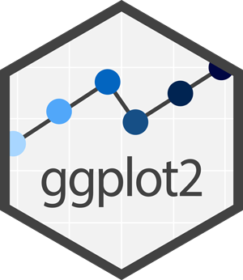
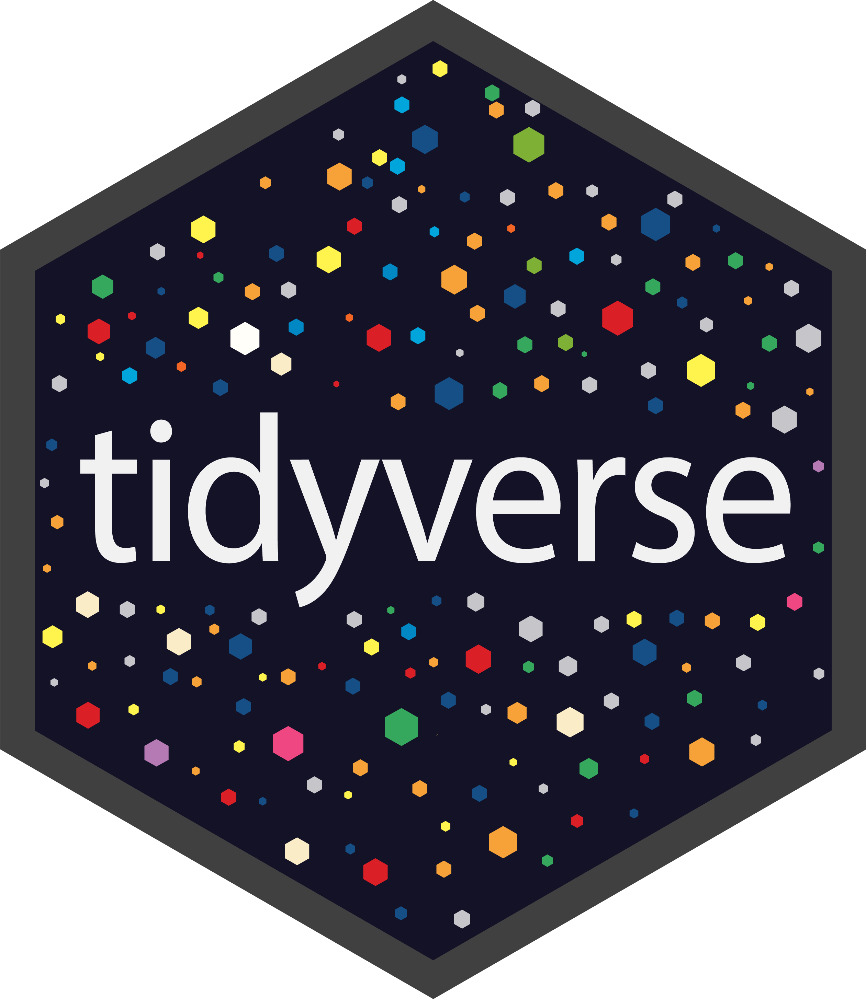

<header
  
  <h1 className="featured-image h1">
  Abdelkarim el Ghani
  </h1>
  <h3 className="featured-image h3">
  Data Analyst | Neuroscientist
  </h3>
</header>

::::::: grid
::: {.g-col-12}
::: {style="text-align: center;"}

  
  
  
  

:::
:::
:::::::

::: {.g-col-12 .g-col-md-6}
Welcome to My Portfolio!\
I’m a statistical data analyst specializing in uncovering meaningful insights from complex datasets. My work lies at the intersection of neuroscience and data science, with a focus on statistical modeling, data visualization, and managing large-scale research initiatives.

With expertise in analyzing neurodevelopmental data and driving reproducible research, I aim to support data-driven solutions that enhance our understanding of human behavior and scientific processes.

To dive into the projects I’ve worked on, visit my [Projects](projects.qmd) page, where you’ll find detailed insights into the work I’ve done, ranging from statistical modeling to data visualization.

If you'd like to know more about my background, skills, and experience, check out the [About Me](about.qmd) page.

Let’s connect and explore how statistical analysis can contribute to impactful research and informed decision-making.
:::

