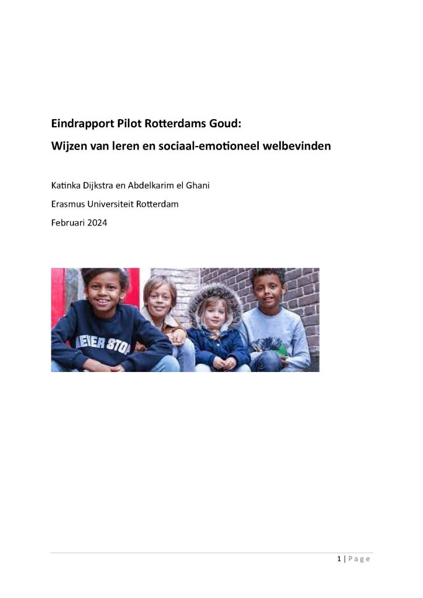

<!-- HEADER & NAVBAR -->

<header class="header">

<a href="#" class="logo">Abdelkarim el Ghani</a>

<nav class="navbar">

<ul>

<li><a href="#hero" class="active">Home</a></li>

<li><a href="#about">About</a></li>

<li><a href="#skills">Skills</a></li>

<li><a href="#projects">Projects</a></li>

<li><a href="#contact">Contact</a></li>

</ul>

</nav>

</header>

<!-- HERO SECTION -->

<section id="hero" class="home show-animate">

:::: home-content
Hi, I’m Abdelkarim el Ghani I'm a Statistical Data Analyst and Neuroscientist who mixes data analytics with modern web development. I love turning complex problems into intuitive, elegant solutions.

::: hero-buttons
[View My Work](#projects){.btn} [Contact Me](#contact){.btn .btn-secondary}
:::
::::

</section>

<!-- ABOUT SECTION -->

<section id="about" class="about">

About Me

::: {include="about.qmd"}
:::

::::::::::::::::: {include="about.qmd"}
</section>

<!-- SKILLS SECTION -->

<section id="skills" class="skills">

## Skills

::::::: skills-grid
::: skill-box
**Data Analytics**

<p>Python, R, Statistical Modeling</p>
:::

::: skill-box
**Web Development**

<p>HTML, CSS/SCSS, JavaScript, Quarto</p>
:::

::: skill-box
**Neuroscience**

<p>Experimental Design, fMRI, EEG Analysis</p>
:::

::: skill-box
**Reproducible Research**

<p>Open Science, Version Control, CI/CD</p>
:::
:::::::

</section>

<!-- PROJECTS SECTION -->

<section id="projects" class="portfolio">

Projects

:::: project-card


::: portfolio-layer
```         
<h4>Fairplay</h4>
<p>Fairplay focuses on fairness and transparency in its approach.</p>
```
:::
::::

:::: project-card


::: portfolio-layer
```         
<h4>Rotterdam Gold</h4>
<p>Rotterdam Gold showcases premium design and innovative solutions.</p>
```
:::
::::

</section>

<!-- CONTACT SECTION -->

<section id="contact" class="contact">

## Contact {#contact}

<p>Interested in collaborating or just want to say hi? Drop me a line:</p>

::: contact-form
<p><strong>Email:</strong> <a href="mailto:youremail@example.com">youremail\@example.com</a></p>

<p><strong>GitHub:</strong> <a href="https://github.com/akghani">yourusername</a></p>
:::

</section>

<!-- FOOTER -->

<footer class="footer">

::: footer-text
<p>If you'd like to chat, message me at <a href="https://google.nl">✈️</a></p>
:::

::: footer-iconTop
<a href="#hero"><i class="bx bx-up-arrow-alt"></i></a>
:::

</footer>

<!-- External JavaScript Libraries -->

```{=html}
<script src="https://unpkg.com/@popperjs/core@2"></script>
```

```{=html}
<script src="https://unpkg.com/tippy.js@6"></script>
```

```{=html}
<script src="https://unpkg.com/aos@2.3.4/dist/aos.js"></script>
```

```{=html}
<script src="https://cdn.jsdelivr.net/npm/vanilla-tilt@1.7.0/dist/vanilla-tilt.min.js"></script>
```

<!-- Initialization Scripts -->

```{=html}
<script> document.addEventListener('DOMContentLoaded', function() { // Initialize AOS AOS.init({ duration: 1000, once: true }); // Initialize Tippy.js for tooltips const terms = document.querySelectorAll('.tooltip-term'); terms.forEach(term => { tippy(term, { content(reference) { const id = reference.getAttribute('data-template'); const template = document.getElementById(id); return template ? template.innerHTML : ''; }, allowHTML: true, theme: 'my-tippy', animation: 'scale', arrow: true, interactive: true, delay: [150, 100], duration: [300, 250], trigger: 'mouseenter focus' }); }); }); // Sticky Navbar & Scroll Handling document.addEventListener("DOMContentLoaded", function() { let menuIcon = document.querySelector('#menu-icon'); let navbar = document.querySelector('.navbar'); if (menuIcon && navbar) { menuIcon.onclick = () => { menuIcon.classList.toggle('bx-x'); navbar.classList.toggle('active'); }; } let sections = document.querySelectorAll('section'); let navLinks = document.querySelectorAll('nav a'); window.addEventListener("scroll", function() { sections.forEach(sec => { let top = window.scrollY; let offset = sec.offsetTop - 100; let height = sec.offsetHeight; let id = sec.getAttribute('id'); if (top >= offset && top < offset + height) { navLinks.forEach(link => { link.classList.remove('active'); let target = document.querySelector(`nav a[href="#${id}"]`); if (target) target.classList.add('active'); }); sec.classList.add('show-animate'); } else { sec.classList.remove('show-animate'); } }); let header = document.querySelector('header'); if (header) header.classList.toggle('sticky', window.scrollY > 100); if (menuIcon && navbar) { menuIcon.classList.remove('bx-x'); navbar.classList.remove('active'); } let footer = document.querySelector('footer'); if (footer) { footer.classList.toggle('show-animate', window.innerHeight + window.scrollY >= document.body.scrollHeight); } }); }); </script>
```


